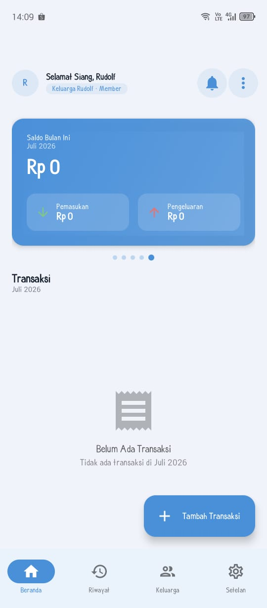
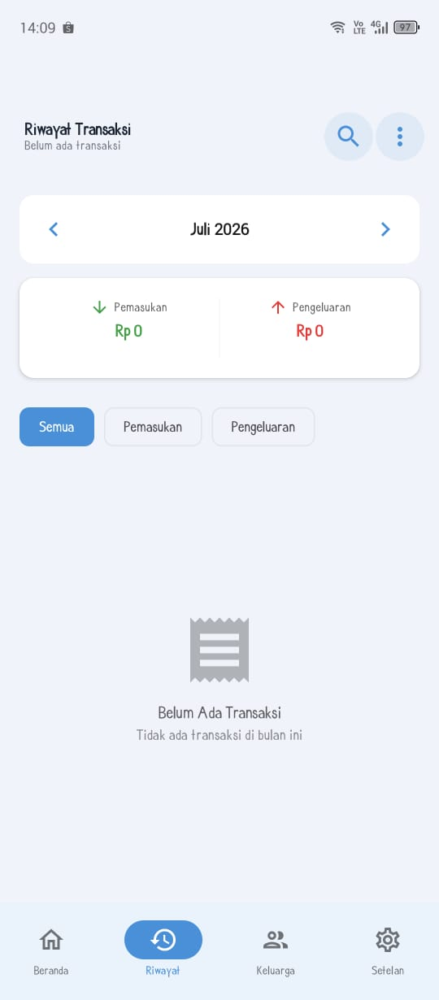
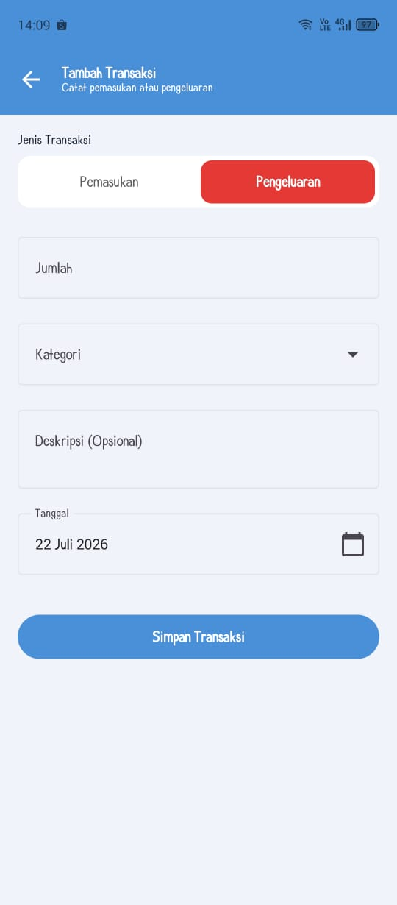
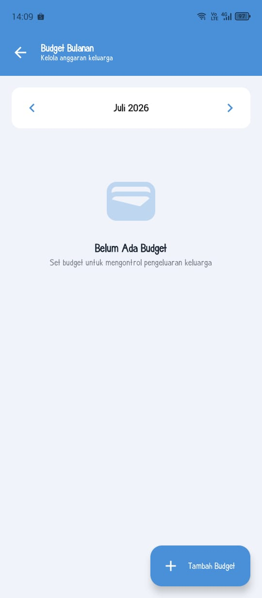
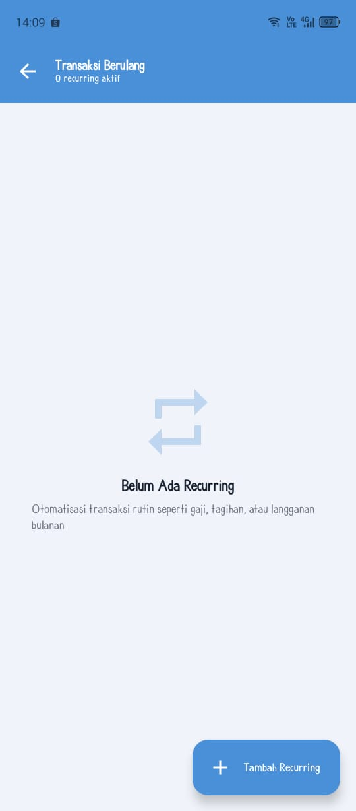
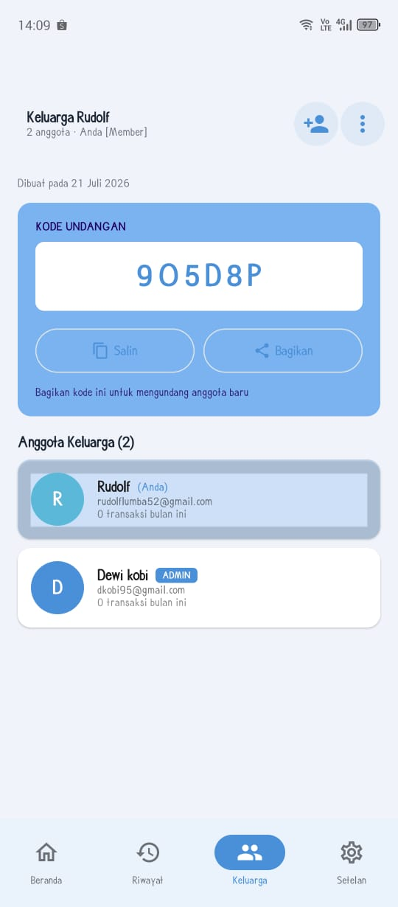
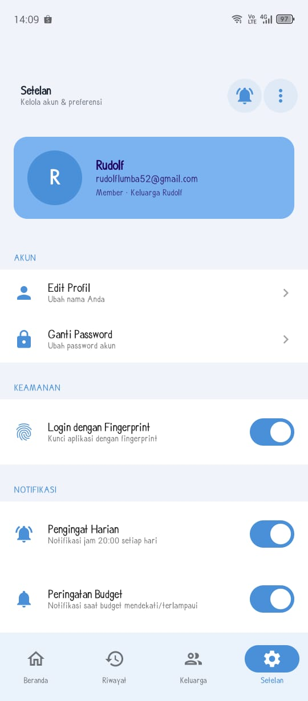
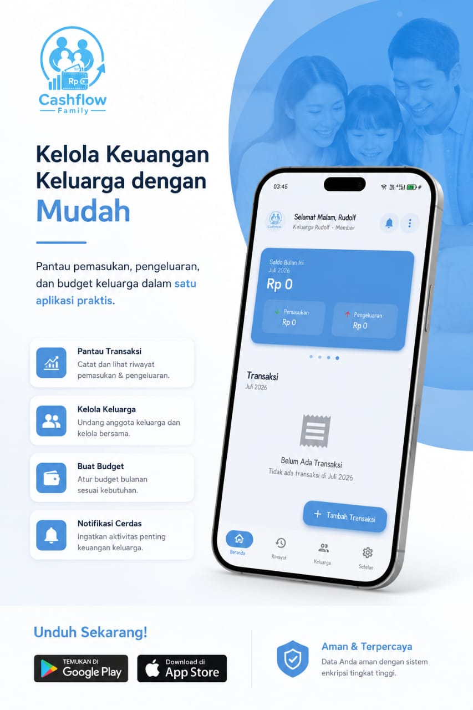

# Cashflow Family — Android

> 📱 Ini adalah versi **Android** dari aplikasi Cashflow Family — aplikasi manajemen keuangan keluarga.

Cashflow Family membantu keluarga mengelola pemasukan, pengeluaran, dan budget bulanan bersama-sama dalam satu aplikasi.

## Fitur

- 💰 Catat transaksi (pemasukan & pengeluaran) dengan kategori
- 👨‍👩‍👧 Kelola keluarga — undang anggota lewat kode undangan
- 📊 Budget bulanan per kategori
- 🔁 Transaksi berulang (recurring) untuk gaji, tagihan, langganan
- 🔔 Notifikasi pengingat harian & peringatan budget
- 🔐 Login dengan fingerprint/biometric
- 📈 Analitik & laporan pengeluaran keluarga

## Tech Stack

- **Kotlin** + **Jetpack Compose**
- **Hilt** untuk dependency injection
- **Firebase / Firestore** sebagai backend (users, families, transactions, budgets, recurring_transactions)
- **MVVM** architecture

## Setup

Project ini membutuhkan file konfigurasi Firebase (`app/google-services.json`) dan keystore signing yang **tidak** disertakan di repo ini karena alasan keamanan. Untuk menjalankan project:

1. Buat project Firebase sendiri di [Firebase Console](https://console.firebase.google.com/)
2. Download `google-services.json` dan taruh di folder `app/`
3. Isi `local.properties` dengan lokasi Android SDK kamu

## Tampilan Aplikasi

| Beranda | Riwayat Transaksi | Tambah Transaksi |
|---|---|---|
|  |  |  |

| Budget Bulanan | Transaksi Berulang | Keluarga |
|---|---|---|
|  |  |  |

| Setelan | Promo |
|---|---|
|  |  |

## Status

Ready to Download & install

📥 [**Download APK (v1.0.0)**](https://github.com/a7x-rudolf/Cashflow-Family/releases/latest)

## License

Lihat file [LICENSE](LICENSE). Kode ini bisa dilihat siapa saja untuk keperluan portofolio/referensi, tapi **tidak boleh dipakai ulang, dimodifikasi, atau didistribusikan** tanpa izin tertulis dari pemilik.

---

Dibuat oleh [Ridolf Widi Alfisa Lumba](https://github.com/a7x-rudolf)
