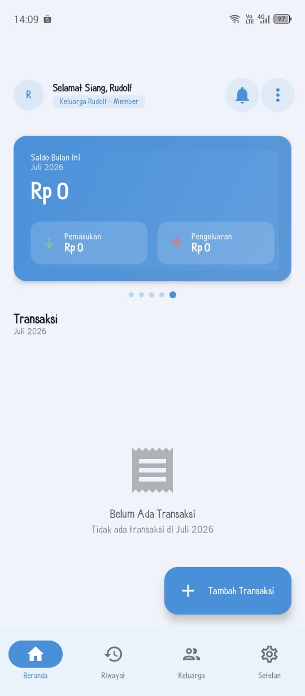
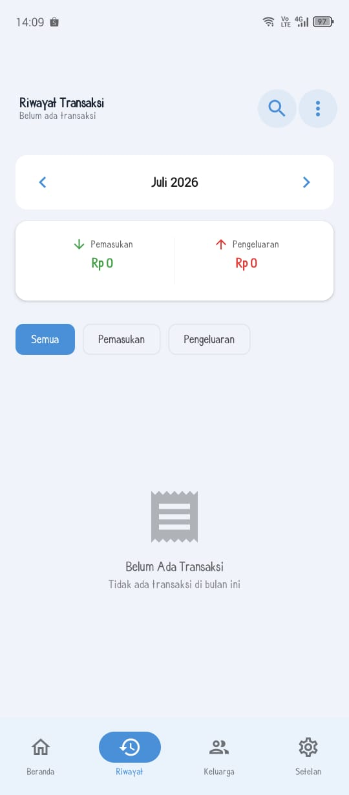
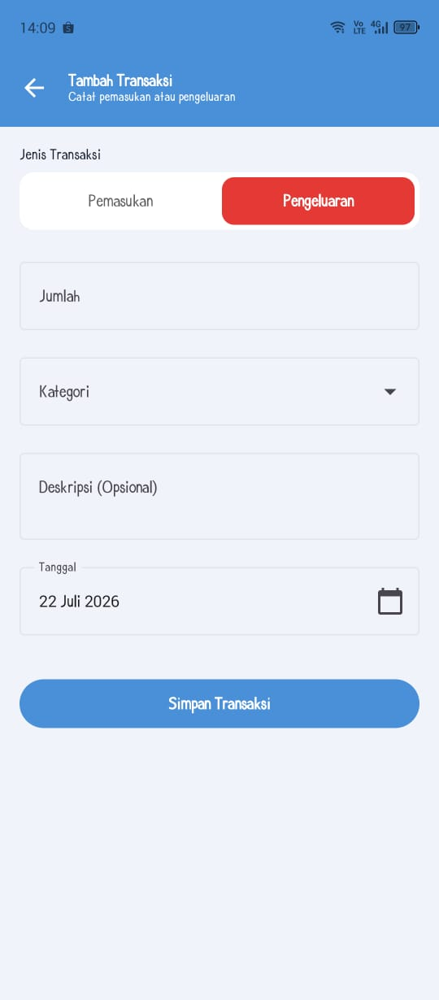
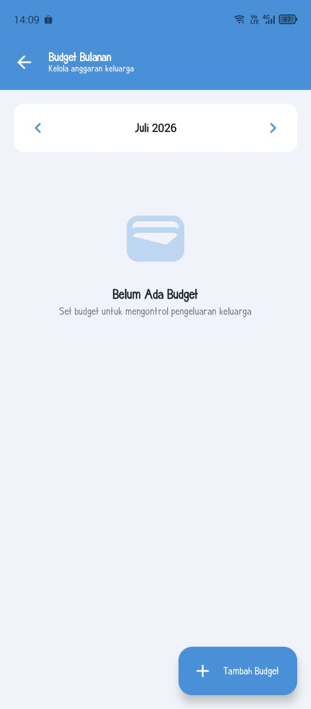
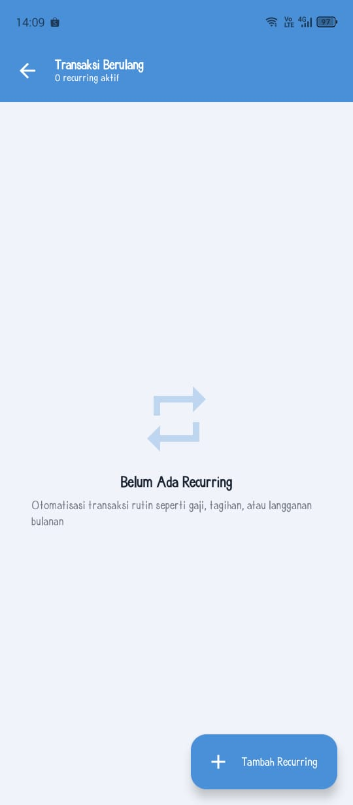
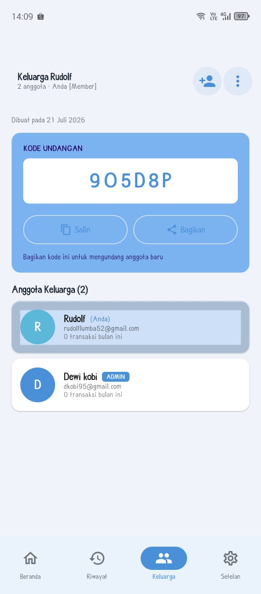
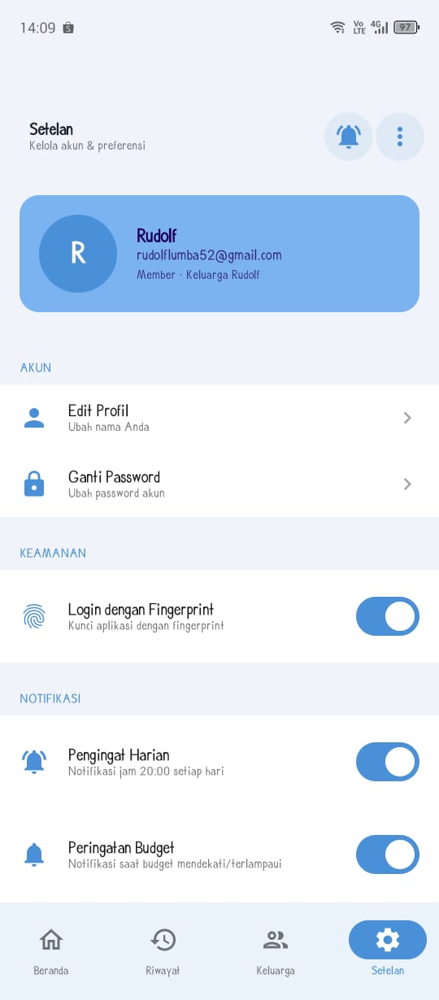
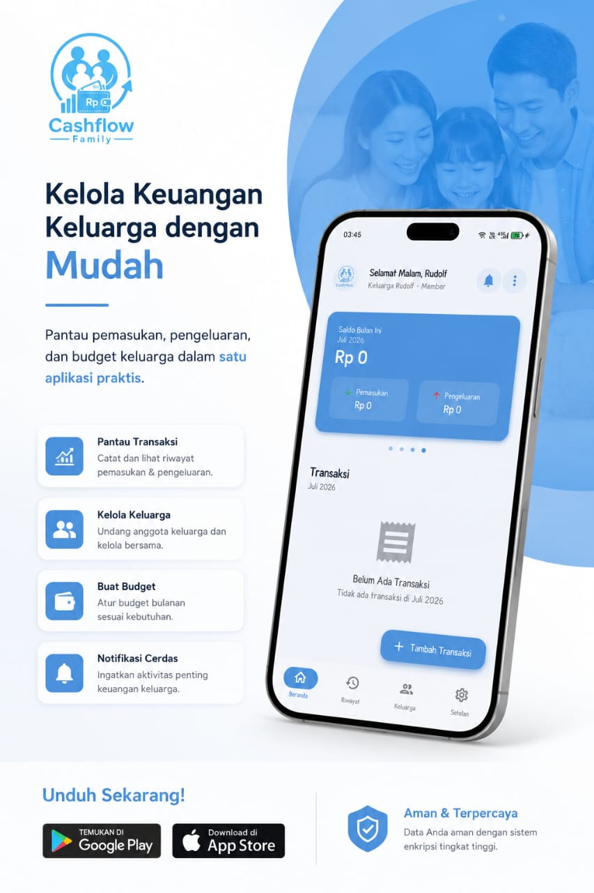

# Cashflow Family — Android

Versi Android dari aplikasi manajemen keuangan keluarga. Membantu keluarga mengelola pemasukan, pengeluaran, dan anggaran bulanan secara kolaboratif.

---

## Fitur

- Pencatatan transaksi pemasukan dan pengeluaran dengan kategori
- Manajemen keluarga dengan undangan anggota melalui kode
- Anggaran bulanan per kategori
- Transaksi berulang untuk gaji, tagihan, dan langganan
- Notifikasi pengingat harian dan peringatan anggaran
- Login dengan fingerprint atau biometric
- Analitik dan laporan pengeluaran keluarga

---

## Teknologi

- Kotlin dengan Jetpack Compose
- Hilt untuk dependency injection
- Firebase Firestore sebagai backend
- Arsitektur MVVM

---

## Persiapan Menjalankan Proyek

File konfigurasi Firebase dan keystore signing tidak disertakan dalam repositori ini.

1. Buat proyek Firebase di Firebase Console
2. Unduh `google-services.json` dan letakkan di folder `app/`
3. Isi `local.properties` dengan lokasi Android SDK

---

## Tampilan Aplikasi

| Beranda | Riwayat Transaksi | Tambah Transaksi |
|---------|-------------------|------------------|
|  |  |  |

| Anggaran Bulanan | Transaksi Berulang | Keluarga |
|------------------|-------------------|----------|
|  |  |  |

| Pengaturan | Promo |
|------------|-------|
|  |  |

---

## Unduh

Aplikasi siap diunduh dan dipasang.

[Download Cashflow Family APK](https://github.com/a7x-rudolf/Cashflow-Family/releases/download/v1.0.0/Cashflow.Family.apk)

---

## Lisensi

Kode ini tersedia untuk tujuan portofolio dan referensi. Penggunaan ulang, modifikasi, atau distribusi tanpa izin tertulis dari pemilik tidak diperbolehkan.

---

Dibuat oleh [Ridolf Widi Alfisa Lumba](https://github.com/a7x-rudolf)
