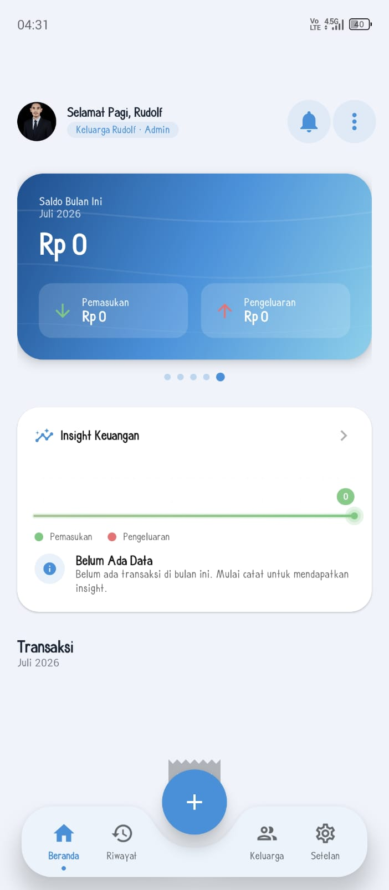
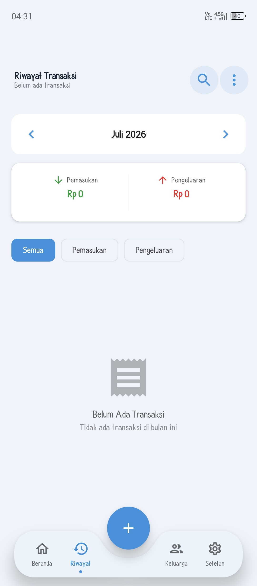
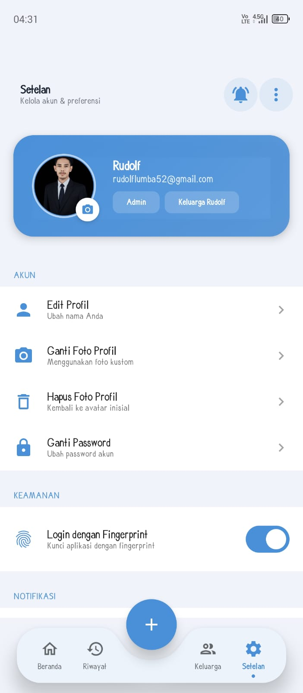
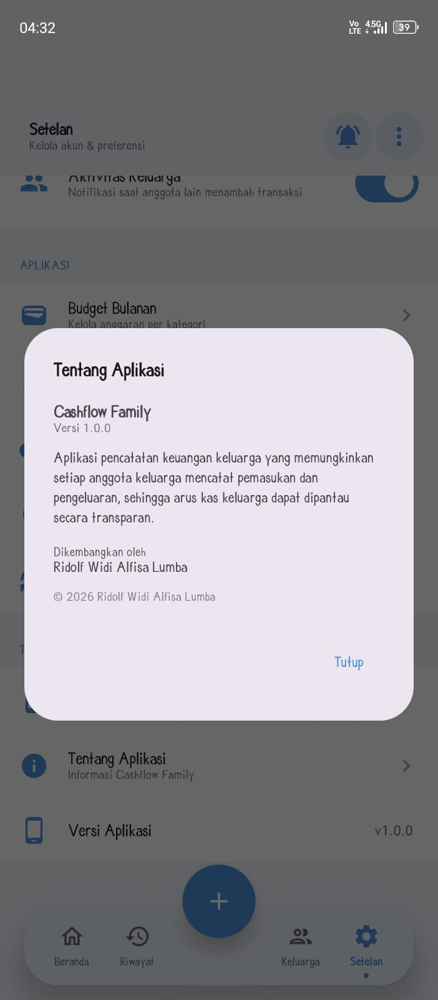

# Cashflow Family

<p align="center">
  
  
  
  
  
</p>

<p align="center">
  Android application for collaborative family financial management with real-time synchronization.
</p>

---

## Table of Contents

- [Features](#features)
- [Technology Stack](#technology-stack)
- [Project Structure](#project-structure)
- [Setup](#setup)
- [Application Screenshots](#application-screenshots)
- [Download](#download)
- [License](#license)

---

## Features

### Transaction Management

- Record income and expenses
- Organize transactions by category
- Complete transaction history
- Search and filter transactions
- Recurring transactions

### Family Collaboration

- Join using a family invitation code
- Real-time synchronization across all members
- Family member management
- Administrator and member roles

### Budget Management

- Monthly budget for each category
- Real-time budget progress
- Budget warning notifications

### Notifications and Security

- Firebase Cloud Messaging push notifications
- Notifications received even when the application is closed
- Google Sign-In
- Biometric authentication
- Automatic application update checking

---

## Technology Stack

### Android Application

| Category | Technology |
|----------|------------|
| Language | Kotlin |
| UI Framework | Jetpack Compose (Material 3) |
| Architecture | MVVM |
| Dependency Injection | Hilt |
| Authentication | Firebase Authentication |
| Database | Cloud Firestore |
| Notifications | Firebase Cloud Messaging |
| Image Loading | Coil |
| Minimum SDK | Android 8.0 (API 26) |
| Target SDK | Android 15 (API 35) |

### Backend

| Category | Technology |
|----------|------------|
| Cloud Functions | TypeScript |
| Push Notification Service | Firebase Admin SDK |
| Security | Firestore Security Rules |

Cloud Functions are responsible for sending real-time push notifications to all family members whenever new transactions, budget updates, or other important activities occur.

---

## Project Structure

```text
Cashflow-Family/
├── app/                    Android application source
├── functions/              Firebase Cloud Functions
├── docs/                   Documentation assets
├── Firestore-rules.txt     Firestore Security Rules
└── README.md
```

> **Note:** The additional push notification server (`cashflow-push-server`) is maintained in a separate repository and is not included in this project.

---

## Setup

Some configuration files are intentionally excluded from this repository for security reasons.

### 1. Firebase Configuration

- Create a Firebase project.
- Enable:
  - Firebase Authentication
  - Cloud Firestore
  - Firebase Cloud Messaging
- Download `google-services.json`.
- Place it inside:

```text
app/google-services.json
```

### 2. Signing Configuration

Create your own release keystore and configure it using either:

```text
app/build.gradle.kts
```

or

```text
keystore.properties
```

### 3. Local Environment

Create:

```text
local.properties
```

Example:

```properties
sdk.dir=C:\\Users\\<username>\\AppData\\Local\\Android\\Sdk
```

### 4. Cloud Functions (Optional)

- Configure your own Firebase Admin SDK credentials.
- Never commit `serviceAccount.json` into the repository.

---

## Application Screenshots

<p align="center">
  
  
  
</p>

<p align="center">
  <strong>Home</strong>
  &nbsp;&nbsp;&nbsp;&nbsp;&nbsp;&nbsp;&nbsp;&nbsp;&nbsp;&nbsp;&nbsp;&nbsp;&nbsp;&nbsp;&nbsp;&nbsp;
  <strong>History</strong>
  &nbsp;&nbsp;&nbsp;&nbsp;&nbsp;&nbsp;&nbsp;&nbsp;&nbsp;&nbsp;&nbsp;&nbsp;&nbsp;&nbsp;&nbsp;&nbsp;
  <strong>Add Transaction</strong>
</p>

<br>

<p align="center">
  
  
</p>

<p align="center">
  <strong>Settings</strong>
  &nbsp;&nbsp;&nbsp;&nbsp;&nbsp;&nbsp;&nbsp;&nbsp;&nbsp;&nbsp;&nbsp;&nbsp;&nbsp;&nbsp;&nbsp;&nbsp;&nbsp;&nbsp;&nbsp;&nbsp;&nbsp;&nbsp;&nbsp;
  <strong>About</strong>
</p>

---

## Download

<p align="center">

<strong>Status</strong>

Ready to download and install.

</p>

<p align="center">

The application is distributed as an APK and supports Android 8.0 (API 26) and above.

</p>

<p align="center">
  <a href="https://github.com/a7x-rudolf/Cashflow-Family/releases/download/v1.0.0/Cashflow.Family.v1.0.0.apk">
    
  </a>
</p>

### Installation

1. Download the APK.
2. Open the downloaded APK.
3. Enable **Install from Unknown Sources** if prompted.
4. Complete the installation.
5. Sign in with your Google account.
6. Start managing your family's finances.

---

## License

This repository is licensed under the terms described in the [LICENSE](LICENSE) file.

The source code is publicly available for:

- Portfolio purposes
- Learning
- Reference

The following actions are **not permitted** without prior written permission from the author:

- Reusing the source code in another project.
- Modifying and redistributing the project.
- Creating derivative works.
- Commercial or non-commercial redistribution.

---

<p align="center">
  Developed by <strong>Ridolf Widi Alfisa Lumba</strong><br>
  <a href="https://github.com/a7x-rudolf">GitHub Profile</a>
</p>
